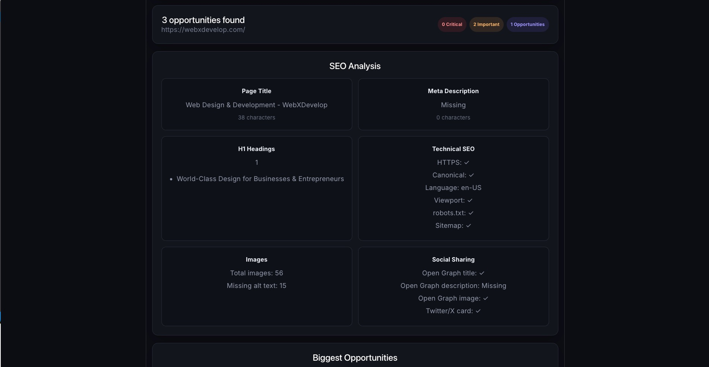

# Website SEO Opportunity Analyzer

A full-stack SEO analysis tool that scans a website and identifies practical opportunities to improve its technical, on-page, internal linking, social, and performance SEO.

**Live Demo:** https://seo.webxdevelop.com/

## Overview

The analyzer is designed to turn technical SEO checks into actionable recommendations rather than simply reporting whether individual elements exist.

Instead of presenting a large list of technical findings, it prioritizes issues by severity and potential score impact, helping users understand what should be fixed first.

The analyzer also integrates Google PageSpeed Insights to provide performance and Core Web Vitals data alongside traditional SEO checks.

## Screenshots

### SEO Score


### SEO Analysis



### Biggest Opportunities


## Features

### SEO Analysis

- SEO score out of 100
- Page title analysis
- Meta description analysis
- H1 heading analysis
- Canonical URL detection
- HTML language detection
- Viewport detection
- HTTPS detection
- Image count analysis
- Missing `alt` attribute detection

### Internal Linking

- Total internal link count
- Unique internal destinations
- External link detection
- Empty anchor text detection
- Generic anchor text detection
- HTTP internal link detection
- Self-link detection
- Most-linked internal pages
- Detailed reporting for problematic internal links

### Technical SEO

- `robots.txt` detection
- `robots.txt` sitemap detection
- Detection of broad `robots.txt` blocking
- XML sitemap detection
- Sitemap URL count

### Social Metadata

- Open Graph title detection
- Open Graph description detection
- Open Graph image detection
- Twitter/X card detection

### Page Performance

- Google PageSpeed Insights integration
- Lighthouse performance score
- Largest Contentful Paint (LCP)
- Cumulative Layout Shift (CLS)
- Interaction to Next Paint (INP)
- First Contentful Paint (FCP)
- Time to First Byte (TTFB)
- Core Web Vitals status classification
- Performance issue detection
- Recommended performance improvements
- Visual performance metric bars
- Performance score visualization

Performance metrics are classified into:

- Good
- Needs improvement
- Poor
- Not available

### Recommendations

- Prioritized SEO opportunities
- Severity classification
- Score impact for each issue
- Actionable fix recommendations
- Top 3 highest-priority issues to address

### Search Preview

- Google-style search result preview
- Page title preview
- Search result URL preview
- Meta description preview

### Analysis Experience

- Loading state while analysis is running
- Progressive analysis messaging
- Re-analysis support
- Error handling for failed requests

## Tech Stack

### Frontend

- React
- TypeScript
- Vite
- Tailwind CSS
- Lucide React

### Backend

- Node.js
- TypeScript
- Fastify
- Cheerio
- `@fastify/cors`
- `@fastify/rate-limit`
- `ipaddr.js`

### Testing

- Vitest

### External APIs

- Google PageSpeed Insights API

## Security

Because the analyzer accepts user-provided URLs, the backend validates remote requests before fetching them.

The analyzer includes:

- HTTP/HTTPS-only URL validation
- Credential-free URL validation
- DNS resolution checks
- Private and reserved IP blocking
- IPv4 and IPv6 address validation
- Redirect destination validation
- Maximum redirect limit
- Request timeouts
- Response size limits
- API rate limiting
- Server-side PageSpeed API key handling

The backend performs URL safety validation before the initial request and again for every redirect destination. This helps protect the server from SSRF attempts involving private, loopback, or otherwise non-public network addresses.

HTML, `robots.txt`, and sitemap responses are also subject to maximum response-size limits.

## Rate Limiting

The analysis endpoint is rate limited to prevent excessive automated requests.

Current configuration:

```ts
rateLimit: {
  max: 5,
  timeWindow: "5 minute",
}
```

This limits each client to a maximum of 5 analysis requests within a 5-minute window.

PageSpeed requests are made server-side and the Google API key is never exposed to the frontend.

## Environment Variables

The backend uses environment variables for configuration and secrets.

Create a `.env` file inside the `server` directory when running locally:

```env
PAGESPEED_API_KEY=your_google_pagespeed_api_key
```

The PageSpeed API key must remain server-side and should never be committed to Git or exposed through frontend environment variables.

For production deployments, configure the environment variable through the hosting platform's environment-variable configuration rather than committing a `.env` file containing the API key.

## Project Structure

```text
website-analyzer/

├── client/
│   ├── src/
│   │   ├── components/
│   │   ├── hooks/
│   │   ├── pages/
│   │   ├── types/
│   │   └── utils/
│   └── package.json
│
├── server/
│   ├── src/
│   │   ├── analyzer/
│   │   ├── routes/
│   │   ├── services/
│   │   │   ├── fetcher.ts
│   │   │   ├── pageSpeedAnalyzer.ts
│   │   │   ├── seoAnalyzer.ts
│   │   │   ├── robotsAnalyzer.ts
│   │   │   ├── sitemapAnalyzer.ts
│   │   │   └── internalLinkAnalyzer.ts
│   │   ├── utils/
│   │   │   ├── readResponse.ts
│   │   │   └── safeUrl.ts
│   │   └── index.ts
│   └── package.json
│
└── README.md
```

## Running Locally

### Frontend

```bash
cd client

npm install

npm run dev
```

The frontend runs on the Vite development server, typically at:

`http://localhost:5173`

### Backend

In a separate terminal:

```bash
cd server

npm install

npm run dev
```

The API runs on:

`http://localhost:3000`

Make sure the required environment variables are configured before starting the backend.

## Testing

The backend uses Vitest for automated testing.

Run the test suite with:

```bash
cd server

npm test
```

This runs the Vitest test suite in a single run.

## API

### Health Check

```text
GET /api/health
```

### Analyze a Website

```text
POST /api/analyze
```

Example request:

```json
{
  "url": "https://example.com"
}
```

The endpoint returns structured SEO, technical, internal-linking, social, and PageSpeed data together with the calculated SEO score and detected issues.

## How It Works

The user submits a website URL through the React frontend.

The Fastify backend then:

1. Validates the submitted URL.
2. Ensures only HTTP and HTTPS URLs are accepted.
3. Rejects URLs containing credentials.
4. Resolves the hostname and checks that it points to a publicly accessible address.
5. Fetches the website with timeout and response-size limits.
6. Follows redirects while validating every redirect destination.
7. Parses the HTML using Cheerio.
8. Extracts on-page SEO and social metadata.
9. Analyzes internal links and their anchor text.
10. Checks technical files such as `robots.txt` and `sitemap.xml`.
11. Requests PageSpeed Insights performance data.
12. Evaluates the collected data against a set of SEO rules.
13. Calculates an overall SEO score.
14. Prioritizes detected issues by severity and score impact.
15. Returns the structured analysis to the frontend.

The frontend turns the analysis into a visual report containing the SEO score, technical analysis, internal linking analysis, performance metrics, prioritized opportunities, recommendations, and a search-result preview.

## PageSpeed Analysis

Performance analysis uses the Google PageSpeed Insights API.

The backend requests the performance category and extracts:

- Performance score
- LCP
- CLS
- INP
- FCP
- TTFB

If PageSpeed is unavailable, times out, or returns an error, the SEO analysis still completes and the PageSpeed values are returned as unavailable rather than failing the entire analysis.

The PageSpeed API key is stored exclusively on the backend.

## Production Build

### Frontend

```bash
cd client

npm run build
```

The generated production assets are placed in the `dist` directory.

### Backend

```bash
cd server

npm run build
```

The TypeScript backend is compiled into the `dist` directory.

The production server can then be started with:

```bash
npm start
```

## Disclaimer

This tool provides automated SEO checks and should be used as a starting point for further analysis. It does not replace a complete technical SEO audit or search engine-specific diagnostics.
